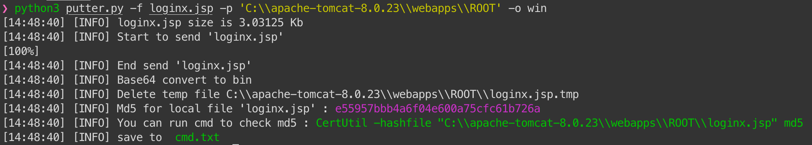
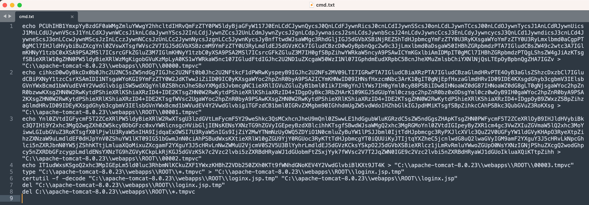
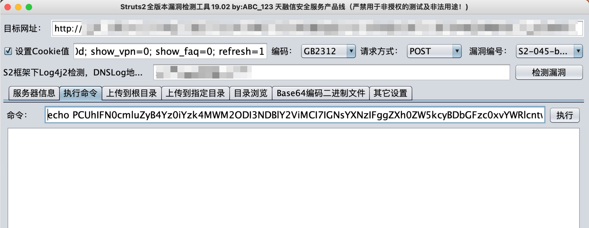
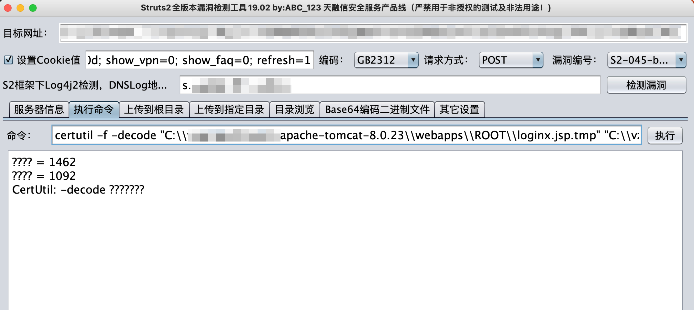

# putter.py

[TOC]

## 简介

可用于解决部分不出网但可以命令执行的环境，可以通过命令执行写入任意文件。

使用前确保linux下有base64命令，以及windows下有certutil命令，不过大部分系统都会自带这些命令


## 使用方法

**linux下**：将1.elf文件上传到/tmp/目录下

```
python3 putter.py -f 1.elf -p '/tmp/'
```


实战案例：

**windows下：**

把loginx.jsp webshell上传到`C:\\apache-tomcat-8.0.23\\webapps\\ROOT`目录下，生成命令到cmd.txt

```
python3 putter.py -f loginx.jsp -p 'C:\\apache-tomcat-8.0.23\\webapps\\ROOT' -o win
```













